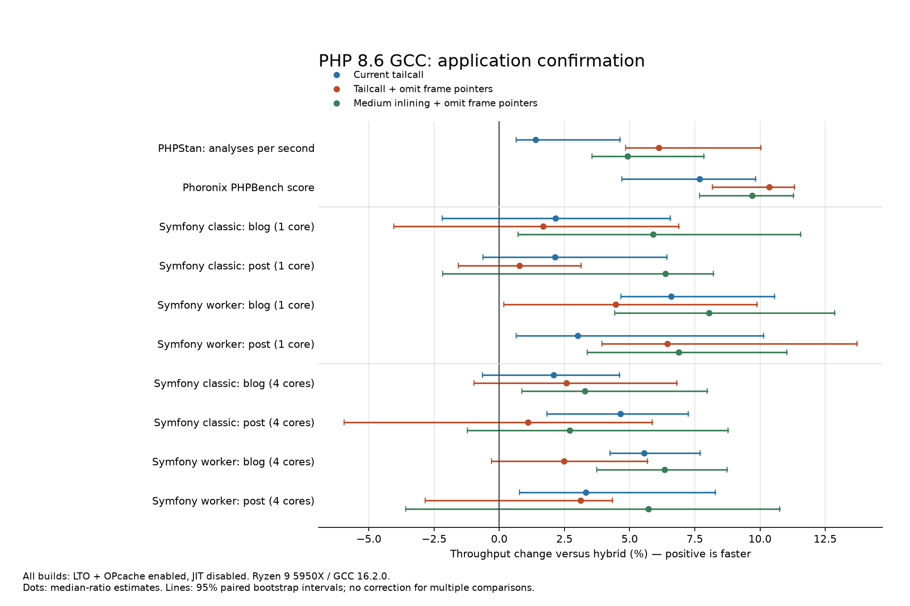
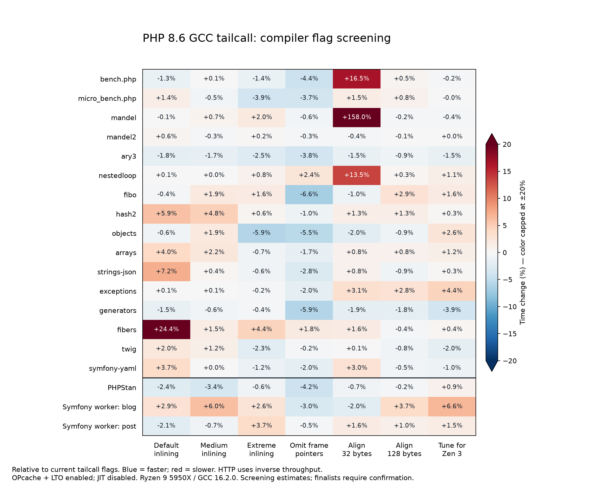

# PHP 8.6 GCC: FrankenPHP, application benchmarks and tailcall compiler flags

**Every benchmark in this study uses OPcache, its normal optimizer and LTO; JIT is disabled.**

**Adopted profile:** Following these measurements, medium inlining plus `-fomit-frame-pointer` was selected for GCC PHP 8.6+ builds. “Current tailcall” below identifies the original benchmark reference: the larger inlining limits with frame pointers retained.

Tailcall's advantage does carry through to Symfony served by FrankenPHP. On one core, current tailcall improves worker throughput by **6.6% on the blog and 3.0% on the post**, with both 95% intervals above zero. Classic-mode gains on one core are approximately 2%, with intervals that include zero. Application behavior differs from the call-heavy Fibonacci microbenchmark.

Among the tested profiles, retaining the current inlining limits and 64-byte alignment is a sound general baseline. Adding `-fomit-frame-pointer` improves PHPStan and PHPBench and removes most of the Fibonacci regression. Medium inlining plus omitted frame pointers is a competitive, smaller alternative for HTTP, with mixed component results. There is no single flag set that wins every workload.

The study includes nine tailcall profiles and one matching hybrid reference, all built from the same PHP snapshot with the same extensions.

## Symfony Demo served by FrankenPHP

Medians are requests per second, higher is better. “Omit FP” changes native C frame-pointer generation. “Medium” additionally lowers the inlining budgets; definitions follow below.

| Mode / page | Hybrid | Current tailcall | Tailcall + omit FP | Medium + omit FP |
| --- | ---: | ---: | ---: | ---: |
| 1 core, classic / blog | 75.32 | 76.94 | 76.59 | 79.76 |
| 1 core, classic / post | 70.69 | 72.20 | 71.23 | 75.19 |
| 1 core, worker / blog | 172.99 | 184.41 | 180.70 | 186.89 |
| 1 core, worker / post | 192.69 | 198.50 | 205.12 | 205.96 |
| 4 cores, classic / blog | 301.53 | 307.81 | 309.27 | 311.46 |
| 4 cores, classic / post | 280.35 | 293.37 | 283.43 | 287.94 |
| 4 cores, worker / blog | 682.49 | 720.42 | 699.43 | 725.68 |
| 4 cores, worker / post | 750.83 | 775.80 | 774.30 | 793.75 |

Throughput change relative to hybrid, with 95% paired bootstrap intervals. Positive is faster:

| Mode / page | Current tailcall | Tailcall + omit FP | Medium + omit FP |
| --- | ---: | ---: | ---: |
| 1 core, classic / blog | +2.2% [-2.2, +6.5] | +1.7% [-4.0, +6.9] | +5.9% [+0.7, +11.5] |
| 1 core, classic / post | +2.1% [-0.6, +6.4] | +0.8% [-1.6, +3.1] | +6.4% [-2.2, +8.2] |
| 1 core, worker / blog | +6.6% [+4.7, +10.6] | +4.5% [+0.2, +9.9] | +8.0% [+4.4, +12.9] |
| 1 core, worker / post | +3.0% [+0.6, +10.1] | +6.5% [+3.9, +13.7] | +6.9% [+3.4, +11.0] |
| 4 cores, classic / blog | +2.1% [-0.6, +4.6] | +2.6% [-1.0, +6.8] | +3.3% [+0.9, +8.0] |
| 4 cores, classic / post | +4.6% [+1.8, +7.2] | +1.1% [-5.9, +5.9] | +2.7% [-1.2, +8.8] |
| 4 cores, worker / blog | +5.6% [+4.3, +7.7] | +2.5% [-0.3, +5.7] | +6.3% [+3.7, +8.7] |
| 4 cores, worker / post | +3.3% [+0.8, +8.3] | +3.1% [-2.8, +4.3] | +5.7% [-3.6, +10.8] |



Median of each run’s p50 / p99 latency, milliseconds, under the fixed concurrency used above:

| Mode / page | Hybrid | Current tailcall | Tailcall + omit FP | Medium + omit FP |
| --- | ---: | ---: | ---: | ---: |
| 1 core, classic / blog | 27.16 / 33.16 | 25.25 / 33.64 | 25.75 / 33.42 | 24.08 / 32.13 |
| 1 core, classic / post | 27.98 / 35.79 | 27.96 / 35.16 | 28.00 / 35.94 | 26.99 / 36.11 |
| 1 core, worker / blog | 11.77 / 17.70 | 10.92 / 16.41 | 11.18 / 16.46 | 10.79 / 16.11 |
| 1 core, worker / post | 10.38 / 15.95 | 9.64 / 16.04 | 9.38 / 15.12 | 9.30 / 15.07 |
| 4 cores, classic / blog | 26.12 / 34.50 | 25.68 / 34.08 | 25.52 / 33.88 | 25.30 / 32.38 |
| 4 cores, classic / post | 28.35 / 35.64 | 27.01 / 34.39 | 28.02 / 36.64 | 27.33 / 35.95 |
| 4 cores, worker / blog | 11.46 / 17.36 | 10.82 / 16.92 | 11.10 / 16.71 | 10.75 / 16.70 |
| 4 cores, worker / post | 10.40 / 16.67 | 10.04 / 15.85 | 10.09 / 16.07 | 9.88 / 17.01 |

The comparison between VM variants is paired within a mode. Classic versus worker is a separate execution-model comparison: workers retain the application between requests and avoid repeated bootstrap. Do not attribute that much larger mode difference to the tailcall VM. Four-core results have fewer repetitions; use their intervals when assessing small differences.

## PHPStan and official Phoronix PHPBench

| Metric | Hybrid | Current tailcall | Tailcall + omit FP | Medium + omit FP |
| --- | ---: | ---: | ---: | ---: |
| PHPStan full analysis, seconds | 6.585 | 6.494 | 6.206 | 6.277 |
| PHPBench official score | 1,128,390 | 1,215,125 | 1,245,114 | 1,237,819 |
| PHPBench implied timed duration, seconds | 17.725 | 16.460 | 16.063 | 16.157 |

| Change versus hybrid | Current tailcall | Tailcall + omit FP | Medium + omit FP |
| --- | ---: | ---: | ---: |
| PHPStan elapsed time; negative is faster | -1.4% [-4.4, -0.6] | -5.8% [-9.1, -4.6] | -4.7% [-7.3, -3.4] |
| PHPBench score; positive is faster | +7.7% [+4.7, +9.8] | +10.3% [+8.2, +11.3] | +9.7% [+7.7, +11.3] |

| Change versus current tailcall | Current budgets + omit FP | Medium budgets + omit FP |
| --- | ---: | ---: |
| PHPStan elapsed time | -4.4% [-6.1, -2.7] | -3.3% [-4.7, -1.0] |
| PHPBench score | +2.5% [+0.5, +3.5] | +1.9% [-0.7, +4.0] |

All 48 measured PHPStan analyses return zero errors, and all 96 measured parent/worker OPcache probes pass. All 24 official PHPBench invocations complete all 56 subtests. PHPBench is still a collection of interpreter microbenchmarks; the HTTP results above establish the framework behavior directly.

Representative PHPBench subtests, elapsed-time change versus hybrid. The full 56-subtest analysis is linked below. Aggregate gains coexist with individual regressions; these exploratory intervals have no multiple-comparison correction.

| Subtest | Current tailcall | Tailcall + omit FP | Medium + omit FP |
| --- | ---: | ---: | ---: |
| test_while | -31.5% [-34.1, -29.2] | -31.7% [-34.7, -30.4] | -26.2% [-28.1, -25.2] |
| test_do_while | -30.0% [-32.1, -25.5] | -32.3% [-35.0, -29.2] | -27.3% [-29.5, -25.6] |
| test_switch | -27.1% [-29.9, -25.0] | -23.1% [-25.5, -21.8] | -20.5% [-23.3, -19.5] |
| test_ordered_functions | -6.1% [-9.3, -2.7] | +1.2% [-1.8, +5.1] | +0.3% [-1.4, +2.4] |
| test_unordered_functions | -5.3% [-8.2, +4.7] | -1.4% [-3.0, +5.7] | -1.8% [-4.4, +1.5] |
| test_ordered_functions_references | +0.1% [-3.2, +6.1] | -3.5% [-6.4, -1.5] | -4.4% [-7.6, -3.0] |
| test_rand | +26.0% [+13.7, +38.8] | +25.9% [+11.3, +32.3] | -5.3% [-13.2, -3.5] |

## Which flags performed best?

Keep LTO enabled for PHP 8.6. The current general-purpose tailcall baseline remains:

```text
-O3 -flto -falign-functions=64
--param=inline-unit-growth=200
--param=ipa-cp-unit-growth=100
--param=large-function-growth=1000
--param=max-inline-insns-auto=500
--param=max-inline-insns-single=1000
```

For a build prioritizing performance over frame-pointer-based native profiling, the strongest broadly useful additional candidate is **`-fomit-frame-pointer`**. It must override the existing `-fno-omit-frame-pointer` at compilation and survive the LTO link. PHPStan improves by about 4.4% relative to current tailcall, PHPBench score by about 2.5%, and Fibonacci time by about 6%. HTTP gains from this change alone are mixed. Keep frame pointers when their native profiling/debugging benefits matter; the performance flag is not a correctness requirement.

The **medium + omit-FP** alternative uses `100 / 100 / 500 / 250 / 500` in the same parameter order. It reduces shared-library executable `.text` from 22.18 MiB to 15.54 MiB relative to current budgets + omit-FP, approximately 30%. Its HTTP results make it worth considering for a web-focused build. It does not consistently beat current budgets + omit-FP in PHPStan, PHPBench or the component matrix, and its CLI fiber result is worse.

Increasing the budgets beyond the current values is not supported by this screen. The extreme profile grows `.text` to 33.99 MiB without a broad application gain. `-falign-functions=128` and `-mtune=znver3` also have no established broad advantage. Alignment 32 produces a repeatable, large Mandel regression on this host; retain 64 among the tested choices. `-mtune=znver3` preserved `-march=x86-64-v3`, so its result concerns scheduling, not an expanded instruction set.

| Profile | Inline budgets: unit / IPA / large / auto / single | Alignment | Frame pointers | libphp .text MiB |
| --- | ---: | ---: | ---: | ---: |
| GCC defaults | 40 / 10 / 100 / 30 / 200 | 64 | retained | 10.96 |
| Medium | 100 / 100 / 500 / 250 / 500 | 64 | retained | 15.47 |
| Current | 200 / 100 / 1000 / 500 / 1000 | 64 | retained | 22.12 |
| Extreme | 400 / 200 / 2000 / 1000 / 2000 | 64 | retained | 33.99 |
| Current + omit FP | 200 / 100 / 1000 / 500 / 1000 | 64 | omitted | 22.18 |
| Medium + omit FP | 100 / 100 / 500 / 250 / 500 | 64 | omitted | 15.54 |
| Current + align32 | current | 32 | retained | 21.92 |
| Current + align128 | current | 128 | retained | 22.53 |
| Current + tune Zen 3 | current | 64 | retained | 22.44 |

These sizes are the executable `.text` section, excluding read-only tables, unwind data, debug information and other ELF sections. The screen changes parameter groups, so it cannot identify the optimal independent value of each of the five interacting inlining limits.



The screen compares each candidate to current tailcall flags. Default inlining is 24.4% slower on fibers and 7.2% slower on strings/JSON, while some other workloads improve. Medium budgets preserve much more of the benefit. Larger budgets trade code footprint against optimization opportunities; neither “more inlining is always faster” nor “LTO does nothing at defaults” describes these results.

## All earlier micro/component workloads, rerun

Each cell gives elapsed-time change versus the matching hybrid build and its 95% interval; **negative is faster**. Absolute per-workload medians and every sample are in the accompanying raw/derived data. Do not average these overlapping synthetic workloads into an application score.

### Standalone CLI

| Workload | Current tailcall | Tailcall + omit FP | Medium + omit FP |
| --- | ---: | ---: | ---: |
| bench.php | -7.8% [-10.9, -4.3] | -11.0% [-13.2, -6.8] | -10.0% [-12.4, -7.0] |
| micro_bench.php | -0.2% [-5.5, +6.3] | -8.3% [-10.4, +5.2] | -6.3% [-11.1, -1.4] |
| mandel | -4.9% [-5.5, -4.5] | -4.9% [-5.5, -4.5] | -4.8% [-5.2, -4.5] |
| mandel2 | -19.1% [-19.4, -18.7] | -19.0% [-19.3, -18.7] | -18.9% [-19.2, -18.3] |
| ary3 | -27.6% [-32.2, -21.4] | -29.8% [-34.3, -24.1] | -30.9% [-35.5, -25.2] |
| nestedloop | -17.0% [-17.7, -16.6] | -15.2% [-15.6, -14.5] | -15.0% [-15.5, -14.4] |
| fibo | +9.0% [+7.0, +13.7] | +2.5% [+0.9, +3.8] | +2.6% [+1.0, +5.6] |
| hash2 | -5.3% [-6.8, -4.3] | -7.2% [-8.1, -6.4] | -4.8% [-6.4, -3.6] |
| objects | +1.9% [-6.6, +2.8] | -4.6% [-12.2, -3.8] | -4.7% [-12.3, -3.3] |
| arrays | -3.4% [-6.5, -1.8] | -7.4% [-9.4, -3.8] | -9.4% [-11.5, -8.1] |
| strings-json | -3.0% [-3.5, -1.5] | -4.9% [-5.6, -4.5] | -4.0% [-4.6, -3.8] |
| exceptions | -6.5% [-8.1, -5.0] | -6.7% [-8.6, -2.2] | -1.4% [-2.7, -0.7] |
| generators | -7.4% [-9.4, -6.7] | -10.3% [-12.5, -9.5] | -8.9% [-11.2, -8.0] |
| fibers | -6.2% [-7.5, -0.5] | -4.7% [-6.1, -4.3] | +1.5% [-0.1, +2.5] |
| twig | -9.5% [-10.9, -6.0] | -10.3% [-10.7, -10.0] | -11.6% [-11.8, -11.0] |
| symfony-yaml | -7.5% [-8.0, -6.6] | -9.4% [-9.9, -8.2] | -8.7% [-9.4, -7.2] |

### Shared libphp

| Workload | Current tailcall | Tailcall + omit FP | Medium + omit FP |
| --- | ---: | ---: | ---: |
| bench.php | -5.2% [-6.1, -3.9] | -7.8% [-8.5, -6.2] | -5.8% [-7.5, -2.4] |
| micro_bench.php | -5.1% [-6.0, -4.6] | -9.1% [-10.2, -7.4] | -8.0% [-9.1, -6.6] |
| mandel | -1.8% [-3.1, -1.6] | -1.7% [-3.0, -1.3] | -1.9% [-3.2, -1.5] |
| mandel2 | -20.4% [-20.6, -20.1] | -20.5% [-20.8, -20.3] | -20.3% [-20.6, -19.6] |
| ary3 | -6.7% [-7.9, -4.0] | -9.1% [-10.2, -8.2] | -9.8% [-10.8, -8.9] |
| nestedloop | -7.9% [-15.0, -0.7] | -3.8% [-10.6, +4.1] | -3.9% [-10.8, +3.3] |
| fibo | +7.2% [+6.2, +8.7] | +1.3% [-0.3, +2.7] | +1.3% [-0.6, +4.6] |
| hash2 | -3.6% [-7.6, -2.9] | -4.7% [-9.3, -3.0] | -2.7% [-8.0, -1.6] |
| objects | +2.8% [+0.9, +3.4] | -1.4% [-3.1, +0.8] | -4.3% [-5.9, -3.5] |
| arrays | -4.2% [-5.5, -2.7] | -8.3% [-9.3, -6.3] | -9.3% [-10.9, -7.3] |
| strings-json | -1.8% [-3.5, -1.1] | -4.4% [-5.0, -2.3] | -2.8% [-4.7, -1.0] |
| exceptions | -5.9% [-6.9, -4.9] | -9.6% [-12.9, -8.4] | -6.4% [-8.2, -4.1] |
| generators | -3.3% [-5.9, -2.8] | -5.1% [-8.2, -2.1] | -4.3% [-6.8, -3.2] |
| fibers | -5.6% [-6.0, -4.1] | -4.2% [-5.6, -3.5] | -3.8% [-5.5, -2.3] |
| twig | -9.8% [-10.3, -9.1] | -9.8% [-11.0, -8.8] | -9.0% [-9.7, -8.1] |
| symfony-yaml | -8.3% [-9.6, -2.9] | -8.5% [-10.7, -6.1] | -8.8% [-10.1, -7.4] |

The CLI `ary3` hybrid result is noisy and substantially slower than shared libphp; this layout-sensitive outlier also appeared in the earlier study. The new CLI `micro_bench.php` interval is wide and does not establish a current-tailcall gain, while shared libphp does. All samples remain included.

## Fibonacci and the alignment regression

Fibonacci now takes 9.0% more CLI time with current tailcall than hybrid. Omitting frame pointers reduces that gap to 2.5%; shared libphp drops from 7.2% to about 1.3%. The median does not become universally faster than hybrid.

`fibo(30)` makes 2,692,537 tiny recursive calls. Native tailcall opcode dispatch does not eliminate this PHP recursion. It stresses user-call entry and return handling disproportionately, whereas Symfony, Twig and PHPStan execute a much wider opcode mix. Raising the C inlining limits alone did not cure this workload in the screen.

Disassembly of the actual shared libraries shows the current tailcall `DO_UCALL` handler executing `push %rbp; mov %rsp,%rbp` and restoring `%rbp` before its dispatch jump. The omit-FP build replaces this frame setup/restoration with stack alignment adjustments. Return handlers change too. The option also changes register allocation and code layout; the measured effect belongs to the whole compiled profile, not to one isolated instruction.

### Fibonacci hardware counters: CLI

| Counter change versus hybrid | Current tailcall | Tailcall + omit FP | Medium + omit FP |
| --- | ---: | ---: | ---: |
| cycles:u | +8.5% | +1.9% | +0.2% |
| instructions:u | +2.8% | -0.3% | -0.3% |
| branches:u | +4.9% | +4.9% | +4.9% |
| branch-misses:u | -18.8% | -14.9% | -26.8% |

### Fibonacci hardware counters: shared libphp

| Counter change versus hybrid | Current tailcall | Tailcall + omit FP | Medium + omit FP |
| --- | ---: | ---: | ---: |
| cycles:u | +6.7% | -0.8% | -0.8% |
| instructions:u | +2.8% | -0.3% | -0.3% |
| branches:u | +4.9% | +4.9% | +4.9% |
| branch-misses:u | -3.4% | -23.3% | -24.9% |

| Mandel: alignment 32 versus 64 | Counter change |
| --- | ---: |
| cycles:u | +160.0% |
| instructions:u | +0.0% |
| branches:u | +0.0% |
| branch-misses:u | +79959.4% |

Alignment 32 leaves Mandel’s retired instruction and branch counts essentially unchanged, but branch misses rise from 0.68 million to 546.75 million, approximately 800 times as many; cycles rise about 160%. This is consistent with a severe code-layout/branch-prediction problem in this binary on Zen 3, rather than extra PHP work. It does not establish that 32-byte alignment is inherently slower on every CPU.

Hardware counters cover the whole process, including setup and four internal warmups, using ten times the calibrated iteration count. CLI Fibonacci uses medians from eight balanced interleaved blocks. An earlier five-repeat sequential CLI pass contained two slow samples that inflated mean cycle counts; it is retained in the raw archive and not used for the table. Shared-library Fibonacci and Mandel use five-repeat diagnostics. These counters are separate from the primary timing matrix and are not application speed estimates. Exact counter values, event running percentages and repeat variation are retained in the perf output.

## What was measured

All new measurements use **OPcache and its normal optimizer enabled, JIT disabled, and LTO enabled**. No new disabled-OPcache control was run. Every build is ZTS, uses GCC 16.2.0, and comes from the same unmodified PHP 8.6.0-dev source, `aefec40ab2f4858bf2abf8cef707837d3e0315c8`.

The machine is a Ryzen 9 5950X running AlmaLinux 10.2 under WSL2. CLI and shared-library workloads are pinned to logical CPU 4. HTTP uses either CPU 4 or four separate physical cores represented by CPUs 4, 6, 8 and 10; load generation runs on CPUs 16 and 18. Compilation and setup finished before measured runs. Variants run sequentially in randomized, balanced blocks. No samples are discarded. This is a shared development host, not a frequency-locked bare-metal laboratory; the intervals retain the observed noise.

The initial screen contains 1,024 CLI samples, 32 PHPStan analyses and 64 Symfony worker samples. Independent confirmation contains 512 CLI samples, 512 shared-libphp samples, 48 PHPStan analyses, 24 complete official PHPBench runs and 192 HTTP samples. Warmups are excluded from these counts. The screen selected finalists; its many comparisons are exploratory. All reported 95% intervals use 5,000 paired bootstrap resamples of whole measurement blocks and are not corrected for multiple comparisons. Four-core HTTP has only four blocks per configuration and is a scaling check, with correspondingly limited precision.

### PHP and compiler controls

The builds have the same application extension set: Phar, zlib, mbstring, intl, XML/DOM, fileinfo, PDO SQLite, SQLite3, pcntl, posix, OpenSSL, ctype, filter, tokenizer, session and iconv, in addition to core extensions. Their common flags include `-O3 -march=x86-64-v3 -fno-plt -fno-semantic-interposition -fno-math-errno`, PIC, section splitting, `-fcf-protection`, stack-clash protection, `_FORTIFY_SOURCE=3`, RELRO/NOW and a non-executable stack. No candidate changes PHP source, removes these hardening flags, or enables fast-math. Frame-pointer candidates append `-fomit-frame-pointer` to override the common `-fno-omit-frame-pointer`; all others retain the latter and `-momit-leaf-frame-pointer`. Hybrid's LTO link reserves its VM global registers, `r14` and `r15`.

Compiler options are checked in both the actual shared-library link command and GCC's stored LTO object options. Libtool requires forwarding the inlining parameters and function alignment with `-Wc,` at the link step. Binary and library SHA256 hashes, configure/make arguments, compiler defaults and runtime identities accompany the data. The same five inlining parameters appear in the [user-supplied Dockerfile](https://github.com/henderkes/frankenphp-php86-docker/blob/main/Dockerfile). These are compiler growth and size budgets, not instructions to inline every eligible function; GCC's documented [optimization options](https://gcc.gnu.org/onlinedocs/gcc/Optimize-Options.html) explain the individual limits.

LTO is enabled even for the profile named `tailcall-default`: “default” means default inlining limits. LTO already performs interprocedural optimization at those defaults. This study tests the tradeoff from larger budgets; it does not measure an LTO-off configuration.

### Symfony through FrankenPHP

FrankenPHP is pinned to `9b824f225ea64dd09a52049d96d34ef926af96dd`, built with Go 1.27.0, and dynamically linked to the common PHP 8.6 ABI. One identical executable serves every VM/flag configuration. It has `RUNPATH` rather than an overriding `RPATH`, so `LD_LIBRARY_PATH` selects the intended library. Every server checks `/proc/PID/maps`, the mapped library's hash, the VM identifier, ZTS, SAPI and INI settings. Unused Brotli, watcher, Mercure and database-driver features are excluded by Go build tags; this benchmark has no response compression.

Symfony Demo is pinned to `8d2e2ef75c3e18df173d8bf2379a14abb58c4c31`, with its unchanged Composer lock: Symfony 8.1.0 and Twig 3.27.1. Both routes use its real bundled SQLite fixture database:

- Blog index: `/en/blog/`.
- Post: `/en/blog/posts/lorem-ipsum-dolor-sit-amet-consectetur-adipiscing-elit`.

The production container and AssetMapper/Sass assets are built before timing. The app's existing `public/index.php` and Symfony runtime implement both classic and persistent worker modes. The only application configuration override raises production Monolog thresholds to `critical`, preventing repeated PHP 8.6 compatibility notices from turning the experiment into a logging benchmark. This override is recorded verbatim in the raw data. There is no full-response cache, no database writes, no TLS, and no worker request-count restart.

One-core runs use one PHP thread/worker, two concurrent connections and one wrk thread, with eight blocks per configuration. Four-core runs use four PHP threads/workers, eight connections and two wrk threads, with four blocks. `GOMAXPROCS` matches the server core count. Worker mode has an additional regular PHP thread for diagnostic probes. All services bind only to `127.0.0.1`; Caddy's admin API is disabled.

Each variant/block/mode starts a fresh server and runs both routes. Before each four-second measurement there is a one-second load warmup. Every response must be HTTP 200 and contain at least 5,000 bytes. Sampled full-page hashes must match after normalizing only explicit `Page rendered on` and `Fragment rendered on` HTML comments. Runtime probes record cached-script counts, OPcache hits/restarts, optimizer settings and worker startup identities. Raw wrk output, p50/p90/p99 latency, server CPU time, configuration and library mappings are retained. Reported latency values summarize the per-run percentiles; they are not pooled request percentiles. These are closed-loop saturated load tests, not measurements of a complete production traffic distribution.

### OPcache status caveat in this PHP snapshot

The unmodified PHP snapshot has a ZTS initialization problem in OPcache's memory-size INI callbacks: after global startup, new threads reject those updates and their per-thread directive fields remain zero. Consequently FrankenPHP's status can report negative `used_memory` and `NaN` wasted percentage. This occurs with both VMs and all candidates. The actual 256 MiB shared cache and 8 MiB interned-string allocation exist; scripts are cached, hits accumulate, optimizer bits are `0x7ffebfff`, and measured samples have no cache-full condition or restart. JIT is disabled in both regular threads and workers. The diagnostic preserves the anomaly by encoding nonfinite values as strings. No memory-utilization conclusion uses these broken fields. PHP source was kept identical throughout.

### Other workloads

All 16 earlier micro/component workloads were rerun through both the standalone CLI and a small launcher calling PHP's CLI entry point from shared libphp. Each variant has eight measured processes after two process warmups. Isolated workloads include four internal warmup calls and use calibrated iteration counts shared by all variants. Their timings exclude setup; upstream `bench.php` and `micro_bench.php` use whole-process time. Output checksums must agree and isolated workloads must report themselves cached. The shared launcher measures the library used by embedders, but does not add Go or HTTP overhead.

Component workloads use the repository's installed Twig 3.29.0 and Symfony YAML 7.4.18. Those dependencies were installed before this screen and confirmation began. They differ from the Symfony Demo HTTP dependencies, and the full application builds differ from the earlier reduced-extension builds. Compare variants within the new matrices; do not interpret differences in absolute timings across earlier reports as a VM change.

PHPStan 2.2.2 analyzes Symfony Demo's 49 project files with its upstream level-6 configuration, baseline and Doctrine/Symfony extensions. An isolated temporary directory is deleted before each run, so result/parser/container caches are cold while OS file caches remain warm. Its maximum process count is one, with the normal child worker retained. A dedicated INI and bootstrap verify OPcache enabled, JIT disabled, VM and binary **inside every measured parent and worker**. All 48 measured analyses return identical zero-error JSON, and all 96 process probes pass. Two small bootstrap log writes per analysis are included equally in all timings.

Phoronix Test Suite 10.8.4 runs the unchanged official `pts/phpbench-1.1.6` profile, PHPBench 0.8.1 patched2, with two million iterations and all 56 subtests. The archive SHA256 is `32503bd4ace0c8429493de864ca48bb16febed867e52b75f4369d7145f797718`. `PHP_BIN` selects the exact PHP 8.6 wrapper; system PHP runs only the PTS controller. OPcache is enabled and JIT disabled for both. Six measured complete-profile invocations per variant follow one warmup, interleaved using `FORCE_TIMES_TO_RUN=1`. The score is higher-is-better and equals `20,000,000 / sum(subtest seconds)`, rounded by PTS. Implied duration uses that reciprocal score, not controller wall time. Automatic sample dropping is disabled. The isolated PTS configuration disables network access, uploads, anonymous reporting and browser launch; native XML and every subtest log remain local. Its automatic distribution-compiler label is not the compiler used for these PHP binaries.

## Link-flag question

`SPC_CMD_VAR_PHP_MAKE_EXTRA_LDFLAGS_LIBPHP` is additive. SPC's `unix.php` constructs shared-library flags by concatenating the general configured flags, `SPC_CMD_VAR_PHP_MAKE_EXTRA_LDFLAGS`, and then `SPC_CMD_VAR_PHP_MAKE_EXTRA_LDFLAGS_LIBPHP`. The PHP optimization flags therefore belong in the general link flags and do not need to be duplicated in the libphp-specific variable. The latter can retain only `-Wl,-Bsymbolic-functions`. This study also verifies the resulting compiler command and LTO metadata rather than assuming that a make-variable value survived libtool.

## Scope

These are the best-supported choices among the tested candidates on this GCC/PHP snapshot and Zen 3 host. They are not a global optimum across CPUs, compilers, PHP versions, applications, PGO profiles or all possible flag combinations. Hardening and the existing instruction-set baseline remain fixed.

## Correctness and artifacts

| Shared-library correctness run | Exit status | PHPT outcomes |
| --- | ---: | ---: |
| hybrid-tuned | 0 | PASSED: 432, SKIPPED: 1 |
| tailcall-tuned | 0 | PASSED: 432, SKIPPED: 1 |
| tailcall-omitfp | 0 | PASSED: 432, SKIPPED: 1 |
| tailcall-medium-omitfp | 0 | PASSED: 432, SKIPPED: 1 |

Each configuration passes 432 upstream tests and skips one requiring the unbuilt `zend_test` extension, with no failures or warnings. The selected closures, generators and fibers tests run after timing, with OPcache enabled in the controller, parallel workers and tested processes. Tests that explicitly manipulate OPcache settings are excluded. This is focused validation of the affected execution paths, not the entire PHP test suite.

The artifacts are local; no results were uploaded or published.

- [All build flags, hashes, compiler defaults and LTO evidence](results/php86-gcc16-20260922-flags-builds.json.gz)
- [FrankenPHP build provenance](results/php86-gcc16-20260922-flags-frankenphp-build.json.gz)
- [Screen: all CLI/component samples](results/php86-gcc16-20260922-flags-screen-cli.json.gz), [PHPStan](results/php86-gcc16-20260922-flags-screen-phpstan.json.gz), [Symfony worker](results/php86-gcc16-20260922-flags-screen-http.json.gz)
- [Final CLI samples](results/php86-gcc16-20260922-flags-final-cli.json.gz), [shared libphp samples](results/php86-gcc16-20260922-flags-final-libphp.json.gz)
- [Final PHPStan, including every worker probe](results/php86-gcc16-20260922-flags-final-phpstan.json.gz)
- [Final PTS scores, XML and all 56 subtest logs](results/php86-gcc16-20260922-flags-final-phpbench.json.gz)
- [FrankenPHP one-core samples and configurations](results/php86-gcc16-20260922-flags-final-http-1core.json.gz), [four-core samples](results/php86-gcc16-20260922-flags-final-http-4core.json.gz)
- [Derived comparisons and intervals](results/php86-gcc16-20260922-flags-analysis.json.gz), [all PHPBench subtest comparisons](results/php86-gcc16-20260922-flags-phpbench-subtests.json.gz)
- [Interleaved Fibonacci CLI counters](results/php86-gcc16-20260922-flags-final-fibo-perf-cli-paired.json.gz), [earlier sequential CLI counters](results/php86-gcc16-20260922-flags-final-fibo-perf-cli.json.gz), [shared-library counters](results/php86-gcc16-20260922-flags-final-fibo-perf-libphp.json.gz), [Mandel alignment counters](results/php86-gcc16-20260922-flags-align32-mandel-perf.json.gz)
- [Correctness logs](results/php86-gcc16-20260922-flags-correctness.json.gz), [OPcache status investigation](results/php86-gcc16-20260922-flags-opcache-status-note.json.gz)
- [Exact commands](results/php86-gcc16-20260922-flags-commands.json.gz), [dependencies](results/php86-gcc16-20260922-flags-dependencies.json.gz), [ELF section sizes](results/php86-gcc16-20260922-flags-build-sections.json.gz), [source snapshots and assembly](results/php86-gcc16-20260922-flags-sources.tar.gz)
- [Artifact hashes and validation summary](results/php86-gcc16-20260922-flags-validation.json.gz): 2,408 measured samples, 233,324 checked HTTP responses and 128 server logs with no PHP warnings, fatals or crashes.

The [earlier VM report](php86-gcc-inlining.md) and [earlier application report](php86-application-benchmarks.md) remain available; this study adds actual HTTP serving and independently confirms the flag candidates.

## Reproduction

Use a clean checkout of the pinned PHP source with `configure` generated. Build the reference pair, then the experimental profiles:

```sh
python3 benchmarks/build-vms.py /path/to/php-src /tmp/php86-reference \
    --variants hybrid-tuned tailcall-tuned --application-extensions --jobs 16
python3 benchmarks/build-vms.py /path/to/php-src /tmp/php86-candidates \
    --profiles benchmarks/php86-tailcall-profiles.json --application-extensions --jobs 16
```

Merge the two `builds` dictionaries into one metadata JSON while preserving their common source/compiler metadata. The exact command archive records all measured invocations and seeds. [benchmark-frankenphp.py](benchmark-frankenphp.py) accepts that metadata, the matching dynamic FrankenPHP executable, the prepared Symfony Demo directory and wrk:

```sh
python3 benchmarks/benchmark-frankenphp.py /tmp/php86-builds.json \
    --frankenphp /path/to/frankenphp --demo /path/to/symfony-demo --wrk /path/to/wrk \
    --variants hybrid-tuned tailcall-tuned tailcall-omitfp tailcall-medium-omitfp \
    --runs 8 --duration 4 --warmup 1 --output /tmp/php86-http.json
```

For the four-core check add `--server-cpus 4,6,8,10 --php-threads 4 --connections 8 --client-threads 2` and use a new output path. Prepare the pinned app's production assets/container and the recorded logging override first. Build FrankenPHP following its [official compilation guidance](https://frankenphp.dev/docs/compile/), using the exact source, Go build flags and RUNPATH recorded in the build artifact. The general library must have the same PHP ABI as every candidate.

[benchmark-matrix.py](benchmark-matrix.py), [benchmark-applications.py](benchmark-applications.py) and [perf-matrix.py](perf-matrix.py) reproduce the other measurements. All benchmark commands default to OPcache enabled. PHPStan uses a dedicated INI so its spawned worker inherits the same setting. Replot the results using [plot-flag-screen.py](plot-flag-screen.py) and [plot-flag-confirmation.py](plot-flag-confirmation.py).
