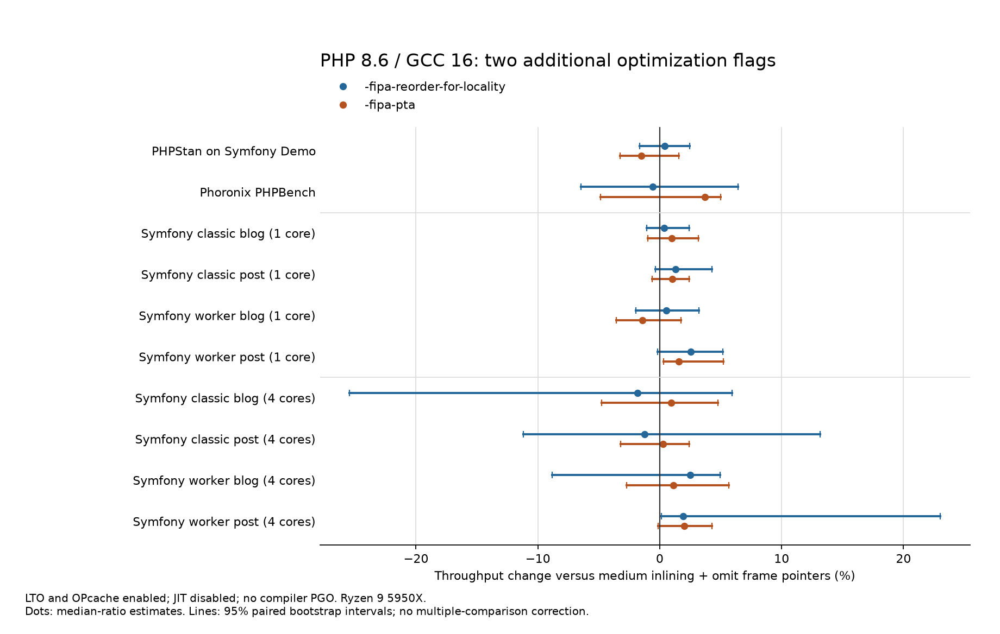

# PHP 8.6 GCC: locality, pointer analysis, and LLVM BOLT

Measured against the selected **medium inlining + omitted frame pointers** tailcall build. Every PHP run uses OPcache, every candidate uses LTO, and compiler PGO is absent. JIT is disabled.

The two extra GCC flags do not establish a broad application improvement on this machine. Keep the selected baseline unless a representative workload demonstrates a repeatable gain. This is an exploratory comparison on a shared Ryzen 9 5950X host, not a guarantee for other CPUs or PHP builds.

## Application timings

Positive changes below mean higher throughput. PHPStan is expressed as reciprocal analysis time; PHPBench uses its official score; HTTP uses requests/second. Brackets are 95% paired bootstrap intervals.

| Workload | `-fipa-reorder-for-locality` | `-fipa-pta` |
|---|---:|---:|
| PHPStan | +0.40% [-1.64, +2.45] | -1.51% [-3.24, +1.58] |
| PHPBench | -0.58% [-6.47, +6.40] | +3.72% [-4.87, +4.99] |
| classic blog (1 core) | +0.35% [-1.05, +2.41] | +0.98% [-0.97, +3.18] |
| classic post (1 core) | +1.28% [-0.34, +4.28] | +1.01% [-0.60, +2.39] |
| worker blog (1 core) | +0.53% [-1.94, +3.20] | -1.43% [-3.56, +1.75] |
| worker post (1 core) | +2.55% [-0.19, +5.17] | +1.57% [+0.30, +5.22] |
| classic blog (4 cores) | -1.83% [-25.45, +5.95] | +0.94% [-4.75, +4.79] |
| classic post (4 cores) | -1.24% [-11.18, +13.16] | +0.27% [-3.20, +2.43] |
| worker blog (4 cores) | +2.50% [-8.83, +4.97] | +1.11% [-2.71, +5.68] |
| worker post (4 cores) | +1.93% [+0.13, +23.03] | +2.02% [-0.14, +4.30] |



Only two of these 20 intervals exclude zero: pointer analysis on the one-core worker post, and locality on the four-core worker post. Both gains are small, and the latter interval is unusually wide because of slow baseline samples. These intervals are not corrected for multiple comparisons. Neither flag reliably improves PHPStan or PHPBench.

| Metric | Medium + omit FP | + locality | + pointer analysis |
|---|---:|---:|---:|
| PHPStan analysis | 6.4252 s | 6.3998 s | 6.5237 s |
| PHPBench score | 1,217,842.5 | 1,210,718.5 | 1,263,117.5 |
| classic blog (http-1core) | 78.22 req/s | 78.49 req/s | 78.99 req/s |
| classic post (http-1core) | 73.23 req/s | 74.17 req/s | 73.97 req/s |
| worker blog (http-1core) | 191.46 req/s | 192.48 req/s | 188.72 req/s |
| worker post (http-1core) | 208.94 req/s | 214.26 req/s | 212.21 req/s |
| classic blog (http-4core) | 316.51 req/s | 310.71 req/s | 319.49 req/s |
| classic post (http-4core) | 298.38 req/s | 294.67 req/s | 299.19 req/s |
| worker blog (http-4core) | 712.62 req/s | 730.40 req/s | 720.57 req/s |
| worker post (http-4core) | 779.16 req/s | 794.17 req/s | 794.88 req/s |

All 36 timed PHPStan analyses returned zero errors and their 72 parent/worker runtime probes confirmed OPcache enabled and JIT disabled. All 18 official PHPBench runs completed 56 subtests. HTTP samples passed page-content, loaded-library, worker-runtime and OPcache checks.

## Build profile

The baseline is:

```text
-flto -falign-functions=64 -fomit-frame-pointer
--param=inline-unit-growth=100
--param=ipa-cp-unit-growth=100
--param=large-function-growth=500
--param=max-inline-insns-auto=250
--param=max-inline-insns-single=500
```

Each candidate adds exactly one flag, in compilation and in the actual libtool-driven LTO link. The locality option groups call chains; GCC recommends profile feedback for it. Pointer analysis is disabled by default and can increase compilation resource usage. See the [GCC optimization reference](https://gcc.gnu.org/onlinedocs/gcc/Optimize-Options.html#index-fipa-reorder-for-locality).

| Build | libphp `.text` bytes | Observed configure/build time |
|---|---:|---:|
| Medium + omit FP | 16,294,552 | 226.3 s |
| + locality | 16,291,672 | 227.7 s |
| + pointer analysis | 16,347,608 | 217.4 s |

These are single build times, not repeated compile-speed measurements. Neither new candidate caused a large observed build-cost increase here. Each passed 432 PHP correctness tests, with one skipped because `zend_test` is not built; there were no failures or warnings.

## Synthetic workloads and noisy-case repeats

The original 16-workload shared-library matrix has descriptive geometric-mean throughput gains of 0.92% for locality and 0.71% for pointer analysis. The initial CLI matrix was noisier. Five CLI workloads exceeded the 3% median-absolute-deviation threshold for at least one variant and were repeated with 18 samples each and a longer calibration target. No shared-library workload crossed that threshold. Both batches remain in the raw archive.

The repeat table shows **elapsed-time changes**; negative is faster. Brackets are 95% paired bootstrap intervals.

| CLI repeat | + locality | + pointer analysis |
|---|---:|---:|
| bench.php | -0.33% [-1.79, +2.53] | +1.19% [-1.13, +3.26] |
| mandel | -0.19% [-0.83, +1.18] | +2.98% [+0.59, +7.87] |
| fibo | +2.61% [+0.96, +5.19] | -0.56% [-2.35, +2.63] |
| hash2 | -0.02% [-1.32, +0.77] | -0.52% [-2.42, +0.99] |
| symfony-yaml | +0.01% [-2.01, +2.27] | +0.99% [-3.04, +2.51] |

Fibonacci does not support the initial 19% CLI regression: the longer repeat is +2.61% for locality and −0.56% for pointer analysis. Shared-library Fibonacci was −1.32% for locality and +1.30% for pointer analysis in the original, steadier matrix. The two SAPIs have different final code layouts. Their differing outcomes are another reason to test the actual shared library used by FrankenPHP.

The main repeatable synthetic gain is exception handling: locality improves the initial CLI timing by about 8% and shared-library timing by about 6%. The CLI counter pass also shows fewer cycles with nearly unchanged instruction count. Pointer analysis retains a small Mandelbrot regression in the longer CLI repeat. These component effects do not establish an application-wide win.

| Original workload | CLI locality | CLI pointer analysis | Shared locality | Shared pointer analysis |
|---|---:|---:|---:|---:|
| bench.php | +2.50% | +2.32% | -0.95% | -0.44% |
| micro_bench.php | -0.59% | -0.06% | +0.32% | -0.31% |
| mandel | -0.72% | +6.50% | +0.84% | +1.24% |
| mandel2 | -0.05% | +0.46% | -0.33% | -0.29% |
| ary3 | +0.37% | +2.83% | +1.17% | +0.13% |
| nestedloop | -0.03% | +0.24% | -0.51% | -1.08% |
| fibo | +18.83% | +1.37% | -1.32% | +1.30% |
| hash2 | +5.63% | -1.88% | -0.00% | -1.47% |
| objects | -0.54% | +0.72% | -1.55% | -0.20% |
| arrays | +0.21% | +2.20% | -0.47% | -0.70% |
| strings-json | -0.22% | -0.19% | -1.89% | -2.46% |
| exceptions | -8.14% | -3.92% | -6.07% | -3.09% |
| generators | -0.14% | -0.75% | -1.01% | -0.45% |
| fibers | +0.52% | -0.32% | -1.27% | -2.00% |
| twig | +5.63% | +0.35% | -1.62% | -0.72% |
| symfony-yaml | -0.70% | -1.03% | +0.27% | -0.69% |

The original table reports elapsed-time changes and includes the noisy observations; use the repeat table above for the five repeated CLI cases.

## Hardware counters

The separate `perf stat` pass contains three measured samples per variant per case, interleaved after a discarded warmup. It covers all 16 CLI workloads, all 16 shared-library workloads, PHPStan, the exact PHPBench payload (`-i 2000000`), and both Symfony routes/modes at one and four cores. There are 378 measured counter samples. Microbenchmark counters cover the whole process, including startup, setup and the four internal warmup calls; their scope is wider than the internal PHP timer. The PHPBench counter pass excludes the PTS controller. PHPStan includes its inherited analysis worker. HTTP counters attach only to the benchmark server PID, including its threads, and use an acknowledged enable/disable window around wrk. Counts are divided by completed requests.

All six hardware events reported 100% running time: cycles, instructions, branches, branch misses, generic cache references and generic cache misses. L1 instruction-cache and instruction-TLB miss probes returned “not counted” and were excluded. Generic cache events must not be interpreted as specific instruction-cache events. These are the guest-visible counters of a WSL2 virtual PMU.

The HTTP counter batches are slower and substantially more variable than the separate timing batches. The counter pass provides execution counts; the separate unprofiled batch supplies the headline throughput estimate. Some four-core cycle medians are dominated by slow samples; their large changes below are retained, not treated as reliable flag effects. Each cell gives **instruction change / cycle change / branch-miss change**, in percent, relative to medium + omit FP. Negative means fewer events.

| Counter workload | + locality: I / C / BM | + pointer analysis: I / C / BM |
|---|---:|---:|
| cli: mandel | -0.00 / +10.75 / +5.98 | +0.00 / +4.87 / +838.41 |
| cli: fibo | -0.00 / +7.52 / -5.08 | +0.00 / +8.04 / -5.84 |
| cli: exceptions | -0.08 / -9.41 / -0.42 | +0.34 / -2.23 / +1.75 |
| libphp: mandel | -0.00 / -0.27 / +0.27 | +0.00 / -0.32 / +0.68 |
| libphp: fibo | -0.00 / -4.33 / -0.85 | +0.00 / +1.93 / -1.24 |
| libphp: exceptions | -0.34 / -1.71 / +1.22 | +0.08 / -6.29 / -2.19 |
| phpstan: phpstan | -0.13 / -0.55 / -2.12 | +0.03 / -1.65 / -0.75 |
| phpbench: phpbench | -0.08 / +1.72 / +4.43 | +0.03 / +0.06 / +9.47 |
| http-1core: classic blog | +0.02 / -1.64 / -0.92 | +0.17 / -3.58 / +0.66 |
| http-1core: classic post | -0.30 / -7.95 / -1.40 | +0.01 / -7.45 / -0.53 |
| http-1core: worker blog | -0.05 / +10.11 / +2.28 | +0.07 / -5.54 / -1.06 |
| http-1core: worker post | -0.10 / +30.08 / +5.89 | +0.07 / -4.92 / -0.17 |
| http-4core: classic blog | +0.49 / +47.54 / +13.46 | +0.03 / -14.19 / -2.91 |
| http-4core: classic post | +1.21 / +109.04 / +21.56 | -0.42 / -1.39 / +1.12 |
| http-4core: worker blog | -0.16 / -11.97 / -5.62 | +0.08 / -10.74 / -3.49 |
| http-4core: worker post | -0.31 / -14.56 / -2.70 | +0.03 / -11.65 / -0.97 |

The useful broad observation is that neither flag materially reduces PHP instruction work: PHPStan and PHPBench instruction changes are within about 0.13%, and the one-core HTTP changes within about 0.3%. The CLI exception case shows a larger cycle reduction for locality, consistent with its timing improvement, despite almost unchanged instructions. This does not identify a specific cache or branch mechanism.

The user-filtered software context-switch event reported zeros even when `/proc` showed switches, so those zeros are not used as evidence of an idle host. HTTP data additionally stores per-thread `/proc` context-switch snapshots and deltas. CLI/application data stores `getrusage` context-switch and CPU-time deltas for the process tree, including the perf launcher. Raw counters, event running times, individual observations and all derived ratios are retained.

The following absolute medians give the counter changes scale. IPC and miss rates here are ratios of the displayed counter medians.

| Workload / build | Instructions | Cycles | IPC | Branch-miss rate | Generic cache misses |
|---|---:|---:|---:|---:|---:|
| PHPStan: baseline | 34.437B | 20.484B | 1.681 | 2.062% | 299.591M |
| PHPStan: locality | 34.393B | 20.371B | 1.688 | 2.020% | 295.266M |
| PHPStan: pointer analysis | 34.448B | 20.145B | 1.710 | 2.047% | 297.014M |
| PHPBench: baseline | 233.671B | 62.620B | 3.732 | 0.080% | 4.487M |
| PHPBench: locality | 233.491B | 63.699B | 3.666 | 0.083% | 3.924M |
| PHPBench: pointer analysis | 233.744B | 62.660B | 3.730 | 0.087% | 4.066M |
| Worker blog / request: baseline | 22.892M | 23.837M | 0.960 | 4.892% | 0.662M |
| Worker blog / request: locality | 22.880M | 26.247M | 0.872 | 5.003% | 0.681M |
| Worker blog / request: pointer analysis | 22.908M | 22.517M | 1.017 | 4.839% | 0.665M |

CLI Mandelbrot’s branch-miss rate changes from 0.128% at baseline to 1.200% with pointer analysis. This is consistent with its small repeated timing regression, but these observations alone do not isolate why branch prediction changed.

## LLVM BOLT experiment

BOLT is technically usable on this GCC/LTO shared PHP library. This experiment uses LLVM BOLT 21.1.8 from the official LLVM Debian packages, extracted locally. No compiler PGO was used; GCC was not rebuilt with profile-use flags. BOLT has its own execution profile, collected from an instrumented copy of the final library.

The three comparison builds are the selected baseline, a **prepared control** adding `-fno-reorder-blocks-and-partition` and link-time `-Wl,--emit-relocs`, and BOLT's rewrite of that exact prepared library. The control matters because its compiler flag changes code layout before BOLT runs. All three remain GCC tailcall/LTO builds with medium inlining and omitted frame pointers. PHPStan runs through the same small shared-library CLI launcher for all three; its absolute times should not be compared directly with the preceding standalone-CLI PHPStan batch.

The host does not expose branch-stack sampling. An instrumented library instead trained on the two Symfony routes in classic and worker modes, on one core with OPcache enabled and JIT disabled. BOLT's periodic profile dump was needed for the shared library; its helper process was cleaned up with the benchmark server's own process group. The retained profile is the accumulated dump from the final server process in each mode, merged across the two modes. Earlier training processes are not included. PHPStan was held out of training.

The rewrite uses:

```text
-reorder-blocks=ext-tsp -reorder-functions=cdsort
-split-functions -split-all-cold -split-eh
-align-functions=64 -align-functions-max-bytes=64
-dyno-stats -update-debug-sections -no-threads
```

The [official BOLT guide](https://github.com/llvm/llvm-project/blob/main/bolt/README.md) documents shared-library support, retained relocations, the GCC block-partitioning constraint and profiling choices. Exact build, instrumentation, merge and rewrite commands, tool/package hashes and profiles are archived with this study.

BOLT found a nonempty profile for 920 of 15,322 functions; 28 profiled functions could not be optimized. It reordered blocks in 731 functions. The log reports a 100% call-graph flow conservation gap, even though its CFG discontinuity and CFG flow gaps are zero. This profile-quality limitation is retained in the evidence rather than presented as an ideal profile. BOLT also warned about 409 unanalyzed relocations, a `make_fcontext` frame-description conflict, a cold function from a static dependency, and unsupported DWARF encodings/forms. Passing tests do not establish complete native unwind/debug-info fidelity.

The prepared control and rewritten library each passed 432 correctness tests with one `zend_test`-dependent skip and no failures or warnings from the PHP test harness. All measured PHPStan analyses and HTTP response/runtime checks passed. This is an exploratory local result, not a production validation of arbitrary extensions or native debugging tools.

The timed BOLT comparison uses six interleaved samples per variant for PHPStan and each of the four one-core HTTP cases. Hardware counters use a separate three-sample pass. Keeping perf out of the timing pass avoids using its visibly perturbed HTTP throughput as the speed estimate. Four-core BOLT and retraining on additional applications were not measured.

Positive changes are throughput gains; brackets are 95% paired bootstrap intervals. “Rewrite vs control” isolates BOLT from its preparation flags.

| Workload | Prepared control vs original | BOLT vs original | Rewrite vs control |
|---|---:|---:|---:|
| PHPStan (shared library) | -1.06% [-1.85, +1.44] | -1.55% [-8.60, -0.04] | -0.50% [-9.46, +1.51] |
| classic blog | +0.83% [-1.19, +7.73] | +0.82% [-3.60, +7.55] | -0.01% [-4.57, +2.54] |
| classic post | +1.24% [-2.01, +5.25] | +2.21% [-2.16, +6.37] | +0.96% [-3.65, +8.04] |
| worker blog | -1.85% [-3.75, +6.74] | -2.58% [-5.98, +5.61] | -0.74% [-5.04, +5.08] |
| worker post | -0.33% [-2.11, +14.99] | +1.76% [-8.43, +22.32] | +2.10% [-6.51, +6.37] |

Absolute medians from this interleaved batch:

| Workload | Original | Prepared control | BOLT |
|---|---:|---:|---:|
| PHPStan (shared library) | 5.915 s | 5.979 s | 6.009 s |
| classic blog | 82.905 req/s | 83.590 req/s | 83.585 req/s |
| classic post | 76.400 req/s | 77.350 req/s | 78.090 req/s |
| worker blog | 178.830 req/s | 175.515 req/s | 174.215 req/s |
| worker post | 196.975 req/s | 196.325 req/s | 200.445 req/s |

The separate hardware-counter pass reports instruction / cycle / branch-miss changes in percent. HTTP counters are per completed request.

| Workload | BOLT vs original: I / C / BM | Rewrite vs control: I / C / BM |
|---|---:|---:|
| PHPStan (shared library) | -0.06 / -2.74 / -0.31 | -0.06 / +3.54 / +1.48 |
| classic blog | +0.11 / -3.29 / -0.52 | +0.06 / -3.86 / -1.92 |
| classic post | +0.09 / -1.54 / +0.13 | +0.17 / -0.49 / -0.87 |
| worker blog | +0.10 / -4.29 / -0.26 | +0.04 / -2.88 / -0.72 |
| worker post | +0.05 / -5.23 / -1.92 | +0.12 / -9.22 / -3.16 |

The BOLT rewrite does **not demonstrate a reliable speedup** in this experiment. Relative to the prepared control, the medians are −0.50% for PHPStan, effectively unchanged for classic blog, +0.96% for classic post, −0.74% for worker blog and +2.10% for worker post. Every one of those intervals includes zero. The complete BOLT build is 1.55% slower than the original on held-out PHPStan, but the rewrite/control comparison does not isolate a statistically clear BOLT penalty.

The wide HTTP intervals leave room for small gains or losses. This result supports keeping the selected compiler profile, not asserting that BOLT can never help PHP. Better representative training, investigation of the reported profile-quality/relocation warnings and measurements on a quieter native host would be needed to establish an advantage beyond this experiment. This run does not establish globally optimal BOLT settings.

## Protocol and limitations

All three primary variants use PHP commit aefec40ab2f4858bf2abf8cef707837d3e0315c8, GCC 16.2.0, ZTS, x86-64-v3, -O3, LTO, 64-byte function alignment, medium inlining and omitted frame pointers. The baseline is the selected medium+omit-FP build. Each candidate appends exactly one flag. Compiler PGO, JIT and fast-math are absent. OPcache and its normal optimizer are enabled in every PHP invocation, including controllers and spawned workers.

Medium means inline-unit-growth=100, ipa-cp-unit-growth=100, large-function-growth=500, max-inline-insns-auto=250 and max-inline-insns-single=500. All five parameters and the candidate flag are forwarded through libtool at LTO link time. Build metadata preserves the actual shared-library link and object LTO options.

CLI/shared microbenchmarks use 12 samples per variant per workload with two discarded warmups. PHPStan uses 12 analyses per variant with two warmups; its result cache is removed outside the timer. PHPBench uses six official PTS runs per variant with one warmup and all 56 PHPBench subtests. Symfony HTTP uses nine blocks on one core and six on four cores: blog and post, classic and worker. Each route gets a one-second warmup and a four-second measurement. CLI work is pinned to CPU 4; four-core HTTP uses CPUs 4,6,8,10; HTTP clients use 16,18. All matrices run sequentially, without compilation or BOLT processing in the background.

The host is a shared Ryzen 9 5950X WSL2 machine. Background activity produced visible CPU waiting in some initial CLI samples. Repeat selection is based only on dispersion: rerun every workload where any variant has median absolute deviation above 3% of its median, retaining the original observations. Repeat runs use 18 samples and a longer 0.4-second calibration target. Shared-library measurements did not cross that threshold.

Intervals resample paired blocks 5,000 times and use the 2.5th/97.5th percentiles. They are unadjusted for multiple comparisons; small isolated wins across this many workloads should not be treated as universal improvements. Geometric means across synthetic workloads are descriptive, without an overall confidence interval.

Symfony Demo, dependencies, fixture database, assets, FrankenPHP executable and wrk are reused unchanged from the preceding study. All are fingerprinted in the raw results. Production logging suppresses PHP 8.6 deprecations to prevent logging from dominating the benchmark. The recorded ZTS OPcache memory-status issue remains unchanged; cached scripts and cache operation are verified, but invalid reported memory fields are not used for conclusions.

## Raw results and reproduction

The study contains **1,746 unprofiled timing samples** (including the 270 noise-selected repeats and 90 BOLT comparison samples), **423 separate measured counter samples**, and 432 passing correctness tests for each of four new libraries. Warmups, BOLT training requests and runtime probes are additional and are not counted as performance samples.

The [artifact manifest](results/php86-gcc16-20260922-ipa-manifest.json) gives sizes and SHA-256 hashes. All `*.json.gz` files are ordinary gzip-compressed JSON:

- [Primary analysis](results/php86-gcc16-20260922-ipa-analysis.json.gz), [CLI timings](results/php86-gcc16-20260922-ipa-cli.json.gz), [shared-library timings](results/php86-gcc16-20260922-ipa-libphp.json.gz), and [longer CLI repeats](results/php86-gcc16-20260922-ipa-cli-noise-repeat.json.gz).
- [PHPStan](results/php86-gcc16-20260922-ipa-phpstan.json.gz), [official PTS PHPBench](results/php86-gcc16-20260922-ipa-phpbench.json.gz), [one-core HTTP](results/php86-gcc16-20260922-ipa-http-1core.json.gz) and [four-core HTTP](results/php86-gcc16-20260922-ipa-http-4core.json.gz).
- [Counter analysis](results/php86-gcc16-20260922-ipa-perf-analysis.json.gz), [CLI counters](results/php86-gcc16-20260922-ipa-perf-cli.json.gz), [shared-library counters](results/php86-gcc16-20260922-ipa-perf-libphp.json.gz), [PHPStan counters](results/php86-gcc16-20260922-ipa-perf-phpstan.json.gz), [PHPBench counters](results/php86-gcc16-20260922-ipa-perf-phpbench.json.gz), [one-core HTTP counters](results/php86-gcc16-20260922-ipa-perf-http-1core.json.gz) and [four-core HTTP counters](results/php86-gcc16-20260922-ipa-perf-http-4core.json.gz).
- [BOLT analysis](results/php86-gcc16-20260922-ipa-bolt-analysis.json.gz), [BOLT PHPStan timings](results/php86-gcc16-20260922-ipa-bolt-phpstan.json.gz), [BOLT HTTP timings](results/php86-gcc16-20260922-ipa-bolt-http-1core.json.gz), [BOLT PHPStan counters](results/php86-gcc16-20260922-ipa-bolt-perf-phpstan.json.gz) and [BOLT HTTP counters](results/php86-gcc16-20260922-ipa-bolt-perf-http-1core.json.gz).
- [GCC build metadata](results/php86-gcc16-20260922-ipa-builds.json.gz), [BOLT build metadata](results/php86-gcc16-20260922-ipa-bolt-comparison-builds.json.gz), [BOLT rewrite log](results/php86-gcc16-20260922-ipa-bolt-optimization.json.gz), [GCC correctness](results/php86-gcc16-20260922-ipa-correctness.json.gz), [BOLT correctness](results/php86-gcc16-20260922-ipa-bolt-correctness.json.gz) and [final validation](results/php86-gcc16-20260922-ipa-validation.json.gz).
- [Source/command/profile archive](results/php86-gcc16-20260922-ipa-sources.tar.gz): frozen timing runners, current counter runners, orchestration and analysis scripts, commands, profile data and tool evidence. The scripts record absolute paths from this machine; adapt those paths when reproducing elsewhere. Rebuilding also requires the recorded PHP/dependency/FrankenPHP environment. Compiled binaries are not copied into the repository.

The reusable counter entry points are [perf-workloads.py](perf-workloads.py), which takes a completed micro/application result as its input, and `benchmark-frankenphp.py --perf`, which measures server threads around the load window. A timing run and its counter run should use different output paths and run sequentially. The parser retains unavailable events, raw counts and running percentages; required cycle/instruction events must be available. [perf's control protocol](https://raw.githubusercontent.com/torvalds/linux/master/tools/perf/Documentation/perf-stat.txt) provides the acknowledged measurement window.

The selected production profile remains **medium inlining + omitted frame pointers + LTO**, with 64-byte function alignment for the x86-64 GCC tailcall VM. This study does not add locality, pointer analysis or BOLT to package defaults. See the [preceding compiler-flag study](php86-frankenphp-flags.md) and the [earlier hybrid/tailcall comparison](php86-gcc-inlining.md) for how the baseline was selected. `SPC_CMD_VAR_PHP_MAKE_EXTRA_LDFLAGS_LIBPHP` is additive to the general PHP linker flags; those flags already carry the PHP optimization settings through libtool, so duplicating them is unnecessary.
